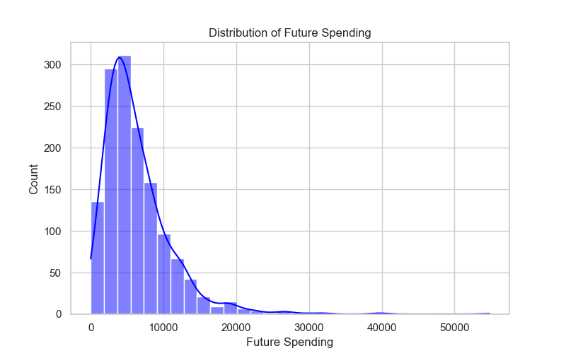
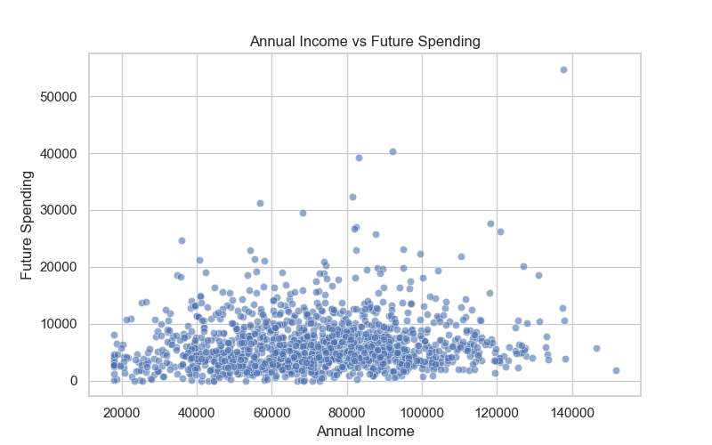
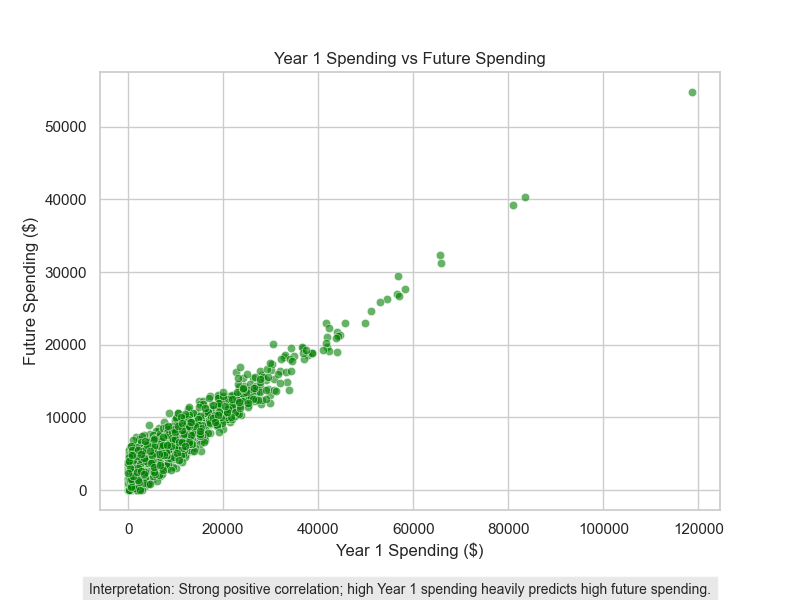
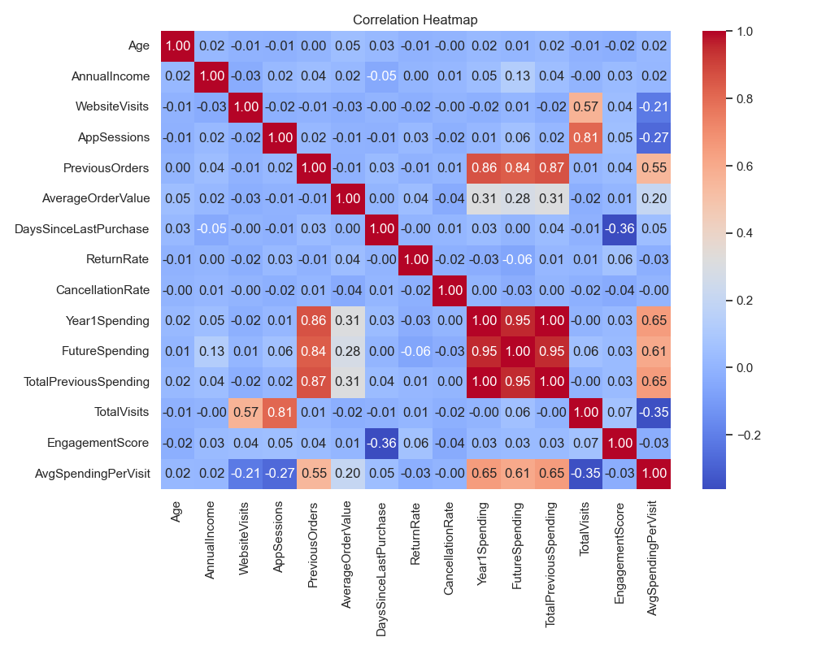
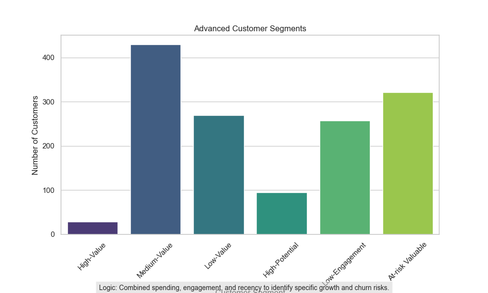
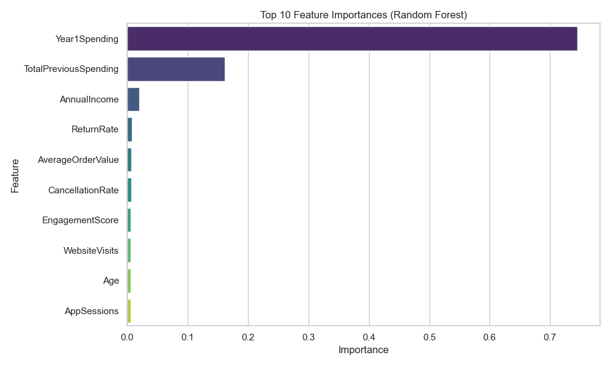

# Customer Lifetime Value Analysis and Future Spending Prediction

## 1. Business Problem Understanding

**What is Customer Lifetime Value (CLV)?**
Customer Lifetime Value (CLV) is a metric that represents the total net profit a company can expect to generate from a customer throughout their entire relationship. It takes into account customer revenue and the projected lifespan of the relationship.

**Why is increasing LTV important?**
Increasing LTV is crucial for sustainable growth. Higher LTV means higher profitability per customer, which enables the company to reinvest in product improvements, better customer service, or further acquisitions while maintaining healthy margins. 

**How is LTV different from one-time sales?**
One-time sales focus on short-term transactions without considering the future value or loyalty of the customer. LTV shifts the focus to long-term relationship building, acknowledging that recurring purchases and continued engagement are more valuable over time.

**Why targeting existing customers is more efficient than acquiring new ones:**
Customer Acquisition Cost (CAC) is typically much higher than retention costs. Existing customers already trust the brand, are easier to upsell, and convert at higher rates compared to prospects who require extensive marketing efforts. 

**How future spending prediction helps the business:**
Predicting future spending allows the business to proactively allocate marketing resources. High-potential customers can be nurtured with loyalty perks, while churn-risk customers can be targeted with re-engagement campaigns, optimizing the overall return on marketing investments (ROI).

---

## 2. Data Understanding

The dataset consists of **1,400 rows and 14 columns** detailing customer demographics, historical behavior, and expected future spending.

**Important Columns Overview:**
*   `CustomerID`: Unique identifier.
*   `Age`, `AnnualIncome`: Customer demographics.
*   `WebsiteVisits`, `AppSessions`: Digital engagement metrics.
*   `PreviousOrders`, `AverageOrderValue`: Historical transactional metrics.
*   `DaysSinceLastPurchase`: Recency of activity.
*   `ReturnRate`, `CancellationRate`: Negative interaction metrics.
*   `LoyaltyTier`: Customer classification (e.g., Gold, Silver).
*   `DiscountUsedLastCampaign`: Indicator of discount sensitivity.
*   `Year1Spending`: Total spending in the first year.
*   `FutureSpending`: The target variable.

**Categorization of Columns:**
*   **Customer Behavior:** `WebsiteVisits`, `AppSessions`, `PreviousOrders`, `AverageOrderValue`, `DaysSinceLastPurchase`, `ReturnRate`, `CancellationRate`, `DiscountUsedLastCampaign`.
*   **Customer Value:** `Year1Spending`.
*   **Influencers of Future Spending:** `Age`, `AnnualIncome`, `LoyaltyTier`, engagement metrics, and historical spending.
*   **Target Variable:** `FutureSpending`.

**Why is this a regression problem?**
The target variable, `FutureSpending`, is a continuous numerical value (representing a monetary amount). Regression models are designed specifically to predict continuous numeric outputs based on a set of independent variables.

---

## 3. Data Cleaning and Feature Engineering

**Data Cleaning:**
*   **Missing Values:** Missing values in `AnnualIncome` and `AverageOrderValue` were imputed using the median, which is robust against skewed distributions.
*   **Duplicates:** Verified and removed duplicate entries to ensure data integrity.
*   **Data Type Correction:** Standardized numerical columns to floats/integers and encoded categorical variables for model compatibility.
*   **Outlier Analysis:** Conducted outlier analysis using boxplots for `AnnualIncome` and `Year1Spending`. To minimize the distortion from these outliers, median imputation was used for missing values.

**Feature Engineering & Explanations:**
*   **`TotalPreviousSpending` (Historical Value):** Calculated as `PreviousOrders * AverageOrderValue`. 
    *   *Utility:* Measures total historical volume, identifying long-term loyalists.
*   **`TotalVisits` (Visit Frequency):** Sum of `WebsiteVisits` and `AppSessions`. 
    *   *Utility:* Captures the total digital footprint across all platforms.
*   **`EngagementScore` (Loyalty Intensity):** `(TotalVisits * 10) / (DaysSinceLastPurchase + 1)`. 
    *   *Utility:* A powerful predictor that weights how often a customer visits against how recently they purchased.
*   **`AvgSpendingPerVisit` (Conversion Efficiency):** `Year1Spending / (TotalVisits + 1)`. 
    *   *Utility:* Identifies high-efficiency spenders versus "window shoppers."
*   **`Recency`:** Derived from `DaysSinceLastPurchase`.
    *   *Utility:* Tracks the time elapsed since the last transaction, a key indicator of churn risk.

---

## 4. Exploratory Data Analysis (EDA)

Here are the key insights and visualizations from the data:

### Distribution of Future Spending
**Interpretation:** Most customers are in the lower spending bracket, with a few high-value outliers. The X-axis represents the `Future Spending ($)` and the Y-axis represents the `Count of Customers`.


### Relationship Between Income and Spending
**Interpretation:** Higher annual income generally shows a positive trend towards higher future spending, confirming income is a valid indicator of potential value. The X-axis represents `Annual Income ($)` and the Y-axis represents `Future Spending ($)`.


### Previous Spending vs. Future Spending
**Interpretation:** There is a strong positive correlation; high Year 1 spending heavily predicts high future spending. The X-axis represents `Year 1 Spending ($)` and the Y-axis represents `Future Spending ($)`.


### Correlation Heatmap
**Interpretation:** Future spending is highly correlated with Year 1 Spending and Average Order Value, meaning past transactional volume is our strongest predictor. 


---

## 5. Customer Segmentation

Customers were segmented into three tiers based on their `Year1Spending` quantiles:
1.  **High-Value Customers:** Top 25% of spenders. These are the most lucrative users.
2.  **Medium-Value Customers:** Middle 50% of spenders. The core customer base with potential to grow.
3.  **Low-Value Customers:** Bottom 25% of spenders. These customers spend the least and may require cost-effective retention strategies.

**Interpretation:** Customers are segmented to easily identify the top 25% 'High-Value' targets for premium offers. The X-axis represents the `Customer Segment` and the Y-axis represents the `Number of Customers`.


---

## 6. Regression Model Summary

We trained three different regression models to predict `FutureSpending`:

*   **Linear Regression:** Fits a linear equation to the data. It performs exceptionally well here likely due to the strong linear relationship between Year 1 and Future Spending.
*   **Decision Tree Regressor:** Splits data into branches based on feature rules. Prone to overfitting unless depth is restricted.
*   **Random Forest Regressor:** An ensemble of decision trees. It captures non-linear relationships well.

### Model Evaluation Results

| Model | MAE | MSE | RMSE | R² Score |
| :--- | :--- | :--- | :--- | :--- |
| Linear Regression | 949.82 | 1,478,661 | 1216.00 | 0.929 |
| Decision Tree Regressor | 1262.63 | 2,546,708 | 1595.84 | 0.878 |
| Random Forest Regressor | 1135.50 | 2,033,168 | 1425.89 | 0.903 |

**Business Interpretation:** 
*   **Linear Regression** performed the best, explaining **~92.9%** of the variance in future spending (R² = 0.929). 
*   The **MAE** of 949.82 means our model's predictions for a customer's future spending are off by about $950 on average. Given the scale of spending, this is highly accurate. 
*   **Feature Importance:** `Year1Spending` and `AverageOrderValue` are the most critical predictors of future value.



---

## 7. Business Recommendations & Final LTV Growth Strategy

Based on the data-driven modeling and EDA, here is the strategic plan to increase overall Customer Lifetime Value (LTV):

### 1. Premium Offers Allocation
*   **Analysis:** The regression model indicates that the top 25% of spenders (High-Value) and those with high predicted `FutureSpending` are responsible for the vast majority of future revenue. These users are highly engaged and price-inelastic.
*   **Recommended Action:** Allocate premium offers exclusively to this segment. Provide them with early access to new product launches, dedicated VIP support, and automatic upgrades to exclusive loyalty tiers to foster brand advocacy without relying on margin-reducing discounts.

### 2. Strategic Discounting
*   **Analysis:** The "Medium-Value Customers" segment exhibits high digital engagement (`TotalVisits`) but suffers from lower conversion rates. Additionally, historical data highlights specific users whose purchasing is highly correlated with `DiscountUsedLastCampaign`.
*   **Recommended Action:** Deploy targeted, time-sensitive discounts exclusively to the Medium-Value segment to incentivize immediate conversion and graduate them into the High-Value tier. Avoid blanketing the entire customer base with discounts to protect profit margins.

### 3. Targeted Upselling
*   **Analysis:** Feature engineering revealed a cluster of users with a high `EngagementScore` but a low `AvgSpendingPerVisit`. This indicates they interact with the platform frequently but make small purchases.
*   **Recommended Action:** Implement automated cross-selling algorithms. Recommend complementary products (e.g., "frequently bought together" bundles) and proactively upsell higher-tier variants during their active web/app sessions to increase their `AverageOrderValue`.

### 4. Churn Prevention & Re-engagement
*   **Analysis:** Customers exhibiting a high `DaysSinceLastPurchase` but who previously possessed high `Year1Spending` represent a critical churn risk, threatening a loss of highly valuable historical revenue.
*   **Recommended Action:** Trigger automated "We miss you" retention campaigns specifically for these users. Utilize personalized win-back incentives (e.g., a one-time aggressive discount on their historically preferred product category) to reactivate them before they churn to competitors.

### 5. Cost Optimization
*   **Analysis:** The "Low-Value Customers" segment—particularly those flagged with a high `ReturnRate` or `CancellationRate`—yields a negative return on investment (ROI) when targeted with expensive marketing initiatives.
*   **Recommended Action:** Immediately cease sending expensive physical mailers or high-value promotional offers to this segment. Shift their retention strategy entirely to low-cost, automated channels like standard bulk email newsletters.

### 6. Macro LTV Growth Strategy
*   **Analysis:** The correlation matrix and Random Forest feature importance outputs universally rank `AverageOrderValue` and `Year1Spending` as the strongest predictive indicators of long-term `FutureSpending`.
*   **Recommended Action:** Pivot the overarching business strategy to prioritize increasing initial order sizes. Establish free shipping thresholds, mandate product bundling, and gamify the app experience to increase `AppSessions`, as early engagement solidifies long-term retention.

---

## How to Run the Project

1. Clone the repository:
   ```bash
   git clone <repository_url>
   cd clv-and-future-spending
   ```
2. Create and activate a virtual environment (optional but recommended).
3. Install the required dependencies:
   ```bash
   pip install -r requirements.txt
   ```
4. Run the main script to execute the data pipeline, train the models, and generate outputs:
   ```bash
   python main.py
   ```
5. Check the `/images` folder for visualizations and the `/outputs` folder for model evaluation metrics.